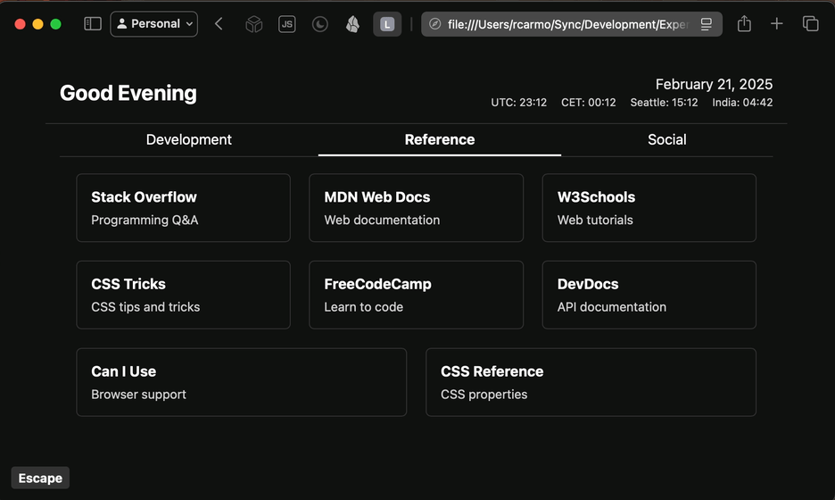

# onepage

This is a simple single-file web application that serves as a homepage/link dashboard combination. It is also a demo of LLM code generation based on a written spec.

The end result looks like this:

## Why

I needed a single-file dashboard that I could use to quickly access my most-used links when working in restricted environments _and_ that replicated the keyboard-oriented type-ahead search functionality of my homelab homepage, since I am so used to doing type-ahead search to find links that I find it hard to work without it.

I also wanted it to be brain-dead simple to deploy so I could upload and use it in environments where I don't have access to a web server (or even the Internet), like industrial remote desktop environments. Just upload a single HTML file, set your browser to open it on startup, and you're done.

Additionally, and since I had to provide my team(s) with a set of onboarding links to customer environments, I thought it would be nice to make it feasible for anyone to edit the content without needing to know how to code at all (although they do have to edit an HTML tag that is a bit awkwardly placed at the very top of the file).

## How

As it happens, I was in a middle of a series of discussions about spec-driven development and LLM code generation, so I wrote a very simple spec for this and then iterated on both the spec and the code to demonstrate the basic principles. Most of the "coding" was actually updating the spec and asking the LLM to implement it, but I also fixed a lot of the styling and bugs manually.

The original spec was:

> Create a single-page web application that serves as a homepage/link dashboard combination. It should be entirely self-contained in a single HTML file, and should not require any external dependencies.
> Links should be displayed as a list of buttons, and should be editable by the user by editing a single HTML tag. 
The application should support keyboard navigation, and should allow the user to perform typeahead find to filter the list of links. The application should also support dark mode.

You then iterate by specifying you want tabs, styling, etc. and fleshing out the spec gradually.

It makes for a pretty cool demo when done right (you can use just about any editor or CLI tool), and I think it is a great way to educate junior developers and people working in regulated industries on the importance of clear, unambiguous specs and recording technical decisions. 

It is also _very_ useful for demonstrating the pitfalls of LLM code generation (especially if you compare reasoning and non-reasoning models). Fortunately, LLMs write decent enough Javascript that you can get a reasonably working implementation even out of Llama 2 (although this was mostly done with `gpt-4o` and `o1`).

For extra bonus points, you can end by comparing the implementation with the spec and asking the LLM to update the spec to match the implementation, as well as adding a `todo.md` regarding the missing functionality (which is the point this repository was committed at).

But, more importantly, the end result is stupefyingly useful to me on a day to day basis. Having a good, educational demo scenario (with the various failure modes of LLM code generation for humor) is just a bonus.
